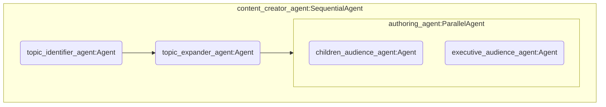

# Eskadra Bielik - Misja 1 - ADK + Cloud Run + Bielik
Przykładowy kod źródłowy pozwalający na:

* Skonfigurowanie własnej instancji modelu [Bielik](https://ollama.com/SpeakLeash/bielik-4.5b-v3.0-instruct) w oparciu o [Ollama](https://ollama.com/)
* Skonfigurowanie prostych systemów agentowych przy wykorzystaniu [Agent Development Kit](https://google.github.io/adk-docs/)
* Uruchomienie obu powyższych serwisów na [Cloud Run](https://cloud.google.com/run?hl=en)

## Przygotowanie projektu Google Cloud

1. Uzyskaj kredyt Cloud **OnRamp**, lub skonfiguruj płatności w projekcie Google Cloud

2. Przejdź do **Google Cloud Console**: [console.cloud.google.com](https://console.cloud.google.com)

3. Stwórz nowy projekt Google Cloud i wybierz go aby był aktywny

4. Otwórz Cloud Shell ([dokumentacja](https://cloud.google.com/shell/docs))

5. Sklonuj repozytorium z przykładowym kodem i przejdź do nowoutworzonego katalogu
   ```bash
   git clone https://github.com/avedave/eskadra-bielik-misja1
   cd eskadra-bielik-misja1
   ```

6. Zmień nazwę pliku `.env.sample` na `.env`
   ```bash
   mv .env.sample .env
   ```

7. Zaktualizuj odpowiednie na tym etapie zmienne środowiskowe w pliku `.env`
      * `BIELIK_EVENT_ID`- Identyfikator warsztatów zgodny z kodem użytym w OnRamp Credits
      * `GOOGLE_CLOUD_LOCATION`- zmienną definiującą region Google Cloud
      * `BIELIK_SERVICE_NAME` - domyślną nazwę dla usługi gdzie uruchomimy Bielika
      * `BIELIK_MODEL_NAME` - wersję Bielika z której będziemy korzystać 

   ```bash
   BIELIK_EVENT_ID="bielik-trainers"
   GOOGLE_CLOUD_LOCATION="europe-west1"  # Europe (Belgium)
   BIELIK_SERVICE_NAME="ollama-bielik-v3"
   BIELIK_MODEL_NAME="SpeakLeash/bielik-4.5b-v3.0-instruct:Q8_0"
   ```
   >[!IMPORTANT]
   >Jeżeli zmieniasz w `BIELIK_MODEL_NAME` domyślny model Bielika na inną wersję, to zaktualizuj tę informację również w pliku `ollama-bielik/Dockerfile`:
   
   ```dockerfile
   ENV MODEL SpeakLeash/bielik-4.5b-v3.0-instruct:Q8_0
   ```
   
   Wczytaj zmienne środowiskowe korzystając z podręcznego skryptu
   
   ```bash
   source reload-env.sh
   ```
## Własna instancja Bielika

Poniższa komenda stworzy nową usługę w Cloud Run o nazwie takiej jak wartość zmiennej `$BIELIK_SERVICE_NAME`. Na podstawie definicji w `ollama-bielik/Dockerfile` nardzędzie `gcloud` stworzy odpowiedni kontener, skonfiguruje usługę Ollama oraz wczyta odpowiednią wersję modelu Bielik.

```bash
gcloud run deploy $BIELIK_SERVICE_NAME --source ollama-bielik/ --region $GOOGLE_CLOUD_LOCATION --concurrency 7 --cpu 8 --set-env-vars OLLAMA_NUM_PARALLEL=4 --gpu 1 --gpu-type nvidia-l4 --max-instances 1 --memory 16Gi --allow-unauthenticated --no-cpu-throttling --no-gpu-zonal-redundancy --timeout 600 --labels dev-tutorial=codelab-dos-$BIELIK_EVENT_ID
```

>[!CAUTION]
>Flaga `--allow-unauthenticated` udostępnia usługę publicznie w internecie i każdy kto zna URL, może zaczać z niej korzystać. W środowisku produkcyjnym zazwyczaj trzeba tę flagę usunąć i odpowiednio skonfigurować reguły dostępu.

Uruchom poniższą komendę, aby sprawdzić pod jakim URL jest dostępny Bielik

```bash
gcloud run services describe $BIELIK_SERVICE_NAME --region=$GOOGLE_CLOUD_LOCATION --format='value(status.url)'
```

Przypisz powyższy URL do zmiennej środowiskowej `OLLAMA_API_BASE` w pliku `.env` i następnie wczytaj zmienne środowiskowe ponownie:
 ```bash
   source reload-env.sh
 ```

### Jak sprawdzić, czy usługa działa?
* Sprawdź w Google Cloud console czy nowy serwis jest już dostępny
* Sprawdź czy otwierając URL w przeglądarce zobaczysz informację: `Ollama is running`
* Sprawdź przez API jakie modele są dostępne lokalnie na serwerze Ollama
   ```bash
   curl "${OLLAMA_API_BASE}/api/tags"
   ```
* Wyślij zapytanie przez API
   ```bash
   curl "${OLLAMA_API_BASE}/api/generate" -d "{
      \"model\": \"$BIELIK_MODEL_NAME\",
      \"prompt\": \"Kto zabił smoka wawelskiego?\",
      \"stream\": false
   }"
   ```

## Konfiguracja systemów agentowych ADK

1. Skonfiguruj swój własny klucz Gemini API
   *   Stwórz lub skopiuj istniejący Gemini API key z [Google AI Studio](https://ai.dev).
   *   Dodaj wartość klucza ze swojego Gemini API key jako wartość zmiennej `GOOGLE_API_KEY` w pliku `.env`
   ```bash
   GOOGLE_API_KEY=TWÓJ_KLUCZ
   ```
2. Wczytaj zmienne środowiskowe ponownie
   ```bash
   source reload-env.sh
   ```
3. Przejdź do katalogu z agentami

   ```bash
   cd adk-agents
   ```
   
4. Stwórz i aktywuj wirtualne środowisko Python

   ```bash
   python -m venv .venv
   source .venv/bin/activate
   ```
   
5. Zainstaluj wymagane komponenty

   ```bash
   pip install -r requirements.txt
   ```

## System agentowy - Twórca treści (`content_creator`)

Ten prosty system agentowy, działający jedynie w oparciu o model Bielik, jest prostym przykładem wykorzystania [LLM Agents](https://google.github.io/adk-docs/agents/llm-agents/) oraz [Workflow Agents](https://google.github.io/adk-docs/agents/workflow-agents/) dostępnych w ADK. System ma na celu generowanie artykułów dla różnych grup docelowych (dzieci, kadra zarządzająca) w oparciu o temat zasugerowany przez użytkownika.

`content_creator_agent` - Główny, sekwencyjny agent, uruchamia pod-agentów jeden po drugim
`topic_identifier_agent` - Agent LLM odpowiedzialny za zidentyfikowanie tematu którym interesuje się użytkownik.
`topic_expander_agent` - Agent LLM odpowiedzialny za rozwinięcie tematu. Generuje listę ciekawych faktów związanych z tematem.
`authoring_agent` - Agent równoległy - uruchamia pod-agentów równolegle. Zawiera dwóch pod-agentów, po jednym na każdą grupę docelową
`children_audience_agent` - Agent LLM odpowiedzialny za tworzenie treści skierowanych do dzieci.
`executive_audience_agent` - Agent LLM odpowiedzialny za tworzenie treści skierowanych do kadry zarządzającej.




1. Upewnij się, że jesteś w katalogu `adk_agents`
2. Uruchom agenta w konsoli **Cloud Shell** i rozpocznij interakcję

   ```bash
    adk run content_creator
   ```
   
10. Przetestuj agenta w środowisku Web
    1. Uruchom środowisko ADK Web
    ```bash
    adk web
    ```
    2. Zmień port w **Web View** (jeżeli potrzeba, zazwyczaj jest to port 8000)
    3. Zaakceptuj zmiany poprzez: *Change and Preview*

11. Uruchom system agentowy `content_creator` w Cloud Run
    ```bash
    gcloud run deploy content-creator-agent --source . --region europe-west1 --allow-unauthenticated --set-env-vars GOOGLE_CLOUD_LOCATION=europe-west1 --set-env-vars OLLAMA_API_BASE=$OLLAMA_URL --labels dev-tutorial=codelab-dos
    ```

Deployment documentation: https://google.github.io/adk-docs/deploy/cloud-run/#python---gcloud-cli